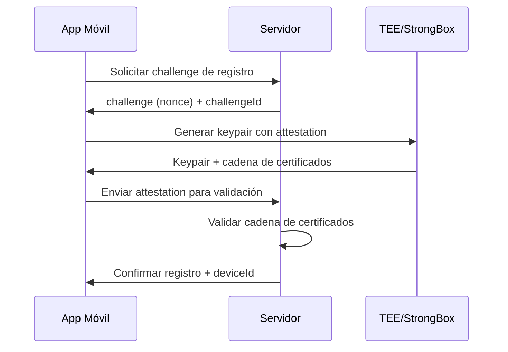
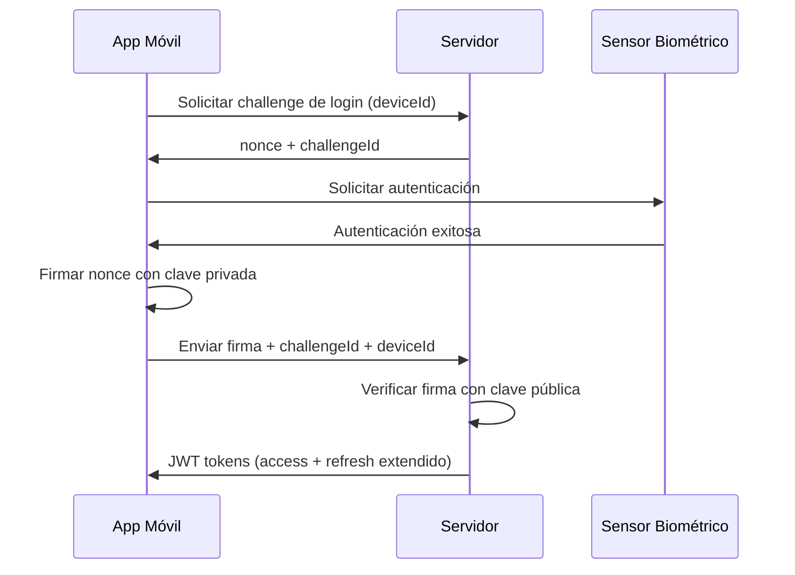

# Implementación de Autenticación Biométrica con Device Attestation

## Resumen

Se ha implementado un sistema completo de autenticación biométrica para versiones móviles que incluye:

- **Device Attestation**: Verificación criptográfica de que las claves se generaron en hardware seguro
- **Autenticación Biométrica**: Login usando huella dactilar/reconocimiento facial
- **Tokens Extendidos**: Refresh tokens con mayor tiempo de vida para dispositivos verificados
- **Arquitectura Segura**: Implementación resistente a falsificaciones y ataques

## Arquitectura de Seguridad

### 1. Registro del Dispositivo (Una vez)


### 2. Login Biométrico (Subsecuente)


## Archivos Implementados

### 1. Plugin de Capacitor (Android)
**Ubicación**: `/android/src/main/java/com/jukai/security/DeviceAttestPlugin.kt`

Funcionalidades:
- `generateKeypairAndAttest()`: Genera claves EC P-256 con attestation
- `signWithBiometrics()`: Firma usando biometría + clave privada
- `checkBiometricAvailability()`: Verifica disponibilidad biométrica
- `deleteKey()`: Elimina claves del keystore

Características de seguridad:
- Claves almacenadas en TEE/StrongBox
- Attestation challenge vinculado
- Autenticación biométrica requerida para uso de clave
- Soporte para múltiples usuarios

### 2. Interfaces TypeScript
**Ubicación**: `/src/app/plugins/device-attest.interface.ts`

Define contratos para:
- `DeviceAttestPlugin`: Interface del plugin nativo
- `BiometricAuthData`: Datos de registro biométrico
- `BiometricLoginChallenge`: Estructura de challenges
- `BiometricLoginResponse`: Respuesta de login

### 3. Servicio de Autenticación Biométrica
**Ubicación**: `/src/app/auth/services/biometric-auth.service.ts`

Responsabilidades:
- Orquestación del flujo de registro
- Manejo de login biométrico
- Almacenamiento local seguro
- Comunicación con backend
- Gestión de errores y fallbacks

### 4. Extensión del AuthService
**Ubicación**: `/src/app/auth/services/auth.service.ts` (actualizado)

Nuevos métodos:
- `isBiometricAvailable()`: Verifica disponibilidad
- `setupBiometricAuth()`: Configura biometría para usuario actual
- `loginWithBiometrics()`: Login usando biometría
- `disableBiometricAuth()`: Desactiva biometría
- `isDeviceRegisteredForBiometric()`: Verifica registro
- `getBiometricInfo()`: Información de registro

### 5. Interfaz de Usuario
**Ubicación**: `/src/app/auth/components/biometric-setup.component.ts`

Componente para:
- Mostrar estado de configuración biométrica
- Configurar autenticación biométrica
- Probar login biométrico
- Desactivar funcionalidad

### 6. Configuración de Build
**Actualizados**:
- `android/app/build.gradle`: Dependencias biométricas
- `android/app/src/main/java/com/jukai/jukai/MainActivity.java`: Registro del plugin
- `capacitor.config.ts`: Configuración del plugin

## Uso de la API

### Configurar Autenticación Biométrica
```typescript
// Verificar disponibilidad
const available = await this.authService.isBiometricAvailable().toPromise();

if (available) {
  // Configurar para usuario actual
  this.authService.setupBiometricAuth().subscribe({
    next: (success) => console.log('Biometric setup successful'),
    error: (error) => console.error('Setup failed:', error)
  });
}
```

### Login Biométrico
```typescript
// Login usando biometría
this.authService.loginWithBiometrics().subscribe({
  next: (user) => {
    console.log('Login successful:', user);
    // Redirigir a dashboard, etc.
  },
  error: (error) => {
    console.error('Biometric login failed:', error);
    // Mostrar formulario tradicional
  }
});
```

### Verificar Estado
```typescript
// Verificar si dispositivo está registrado
const isRegistered = this.authService.isDeviceRegisteredForBiometric();

// Obtener información de registro
const info = this.authService.getBiometricInfo();
if (info) {
  console.log('Security Level:', info.securityLevel);
  console.log('Registered At:', info.registeredAt);
  console.log('Last Used:', info.lastUsedAt);
}
```

## Endpoints del Servidor

El servidor expone estos endpoints bajo `/v1/users/`. En el frontend,
`environment.base_url` ya incluye `/v1`, por lo que el servicio usa `/users/...`.

### 1. Registro de Dispositivo
```
POST /users/biometric-register-challenge/
Response: { challenge: string, challenge_id: string, expires_at: string }

POST /users/biometric-register-validate/
Body: {
  authorizationCheck: true,
  data: {
    type: 'biometric-register',
    attributes: {
      challenge_id: string,
      public_key: string,
      public_key_pem: string,
      attestation_chain: string[],
      attestation_cert_chain_pem: string,
      device_id: string
    }
  }
}
Response: { valid: boolean, securityLevel: string }
```

### 2. Login Biométrico
```
POST /users/biometric-login-challenge/
Body: {
  authorizationCheck: true,
  data: {
    type: 'biometric-login-challenge',
    attributes: { device_id: string }
  }
}
Response: { challenge_id: string, nonce: string, expires_at: string, device_id: string }

POST /users/biometric-login-verify/
Body: {
  authorizationCheck: true,
  data: {
    type: 'login',
    attributes: {
      signature: string,
      challenge_id: string,
      device_id: string,
      key_alias: string
    }
  }
}
Response: { access: string, refresh: string, user: any }
```

### 3. Gestión de Dispositivos
```
DELETE /users/biometric-device/{deviceId}/
Response: { revoked: boolean, device_id: string }
```

## Consideraciones de Seguridad

### Validación en el Servidor
El servidor debe:
1. **Validar Attestation**: Verificar cadena de certificados hasta raíz de Google
2. **Verificar Challenge**: Confirmar que el challenge coincide
3. **Validar Firmas**: Usar ECDSA SHA-256 con clave pública registrada
4. **Rate Limiting**: Limitar intentos por IP y device_id
5. **Expiración**: Nonces con tiempo de vida corto (60-120 segundos)

### Características de las Claves
- **Algoritmo**: EC P-256 (secp256r1)
- **Almacenamiento**: TEE/StrongBox (hardware-backed)
- **No Exportables**: Claves nunca salen del dispositivo
- **Biometría Requerida**: Para usar la clave privada
- **Attestation**: Prueba criptográfica de origen seguro

### Políticas Recomendadas
- **Revocación**: Endpoint para desactivar dispositivos perdidos/robados
- **Re-autenticación**: Forzar login completo cada N días
- **Múltiples Factores**: Combinar con otros factores en operaciones críticas
- **Auditoría**: Logs detallados de uso biométrico

## Deployment

### Construcción
```bash
# Instalar dependencias
npm install

# Construir para Android
npx cap build android

# Sincronizar cambios nativos
npx cap sync android
```

### Permisos Android
El plugin maneja automáticamente los permisos biométricos. Se agregan automáticamente al `AndroidManifest.xml`:
- `android.permission.USE_BIOMETRIC`
- `android.permission.USE_FINGERPRINT`

### Testing
1. **Emulador**: Configurar huellas ficticias en ajustes del emulador
2. **Dispositivo Real**: Registrar huellas reales en configuración del dispositivo
3. **Fallbacks**: Probar escenarios sin biometría disponible

## Troubleshooting

### Errores Comunes
- **"No hardware"**: Dispositivo sin sensor biométrico
- **"None enrolled"**: Usuario no ha registrado huellas
- **"Key not found"**: Clave eliminada o corrupta
- **"Attestation failed"**: Problemas de validación en servidor

### Logs Útiles
```bash
# Android logs
adb logcat | grep -E "(DeviceAttest|BiometricPrompt)"

# Chrome DevTools para debugging web
```

### Regenerar Claves
Si hay problemas con claves:
```typescript
// Eliminar registro actual
await this.authService.disableBiometricAuth();

// Reconfigurar
await this.authService.setupBiometricAuth();
```

## Extensiones Futuras

### iOS Support
- Implementar usando App Attest API
- Keychain Services para almacenamiento seguro
- Touch ID / Face ID integration

### Funcionalidades Adicionales
- **Multi-dispositivo**: Gestionar múltiples dispositivos por usuario
- **Políticas Granulares**: Diferentes niveles de acceso por dispositivo
- **Sincronización**: Backup seguro de configuraciones biométricas
- **Analytics**: Métricas de uso y seguridad

Esta implementación proporciona una base sólida y segura para autenticación biométrica en aplicaciones móviles, siguiendo las mejores prácticas de la industria y aprovechando las capacidades de hardware seguro de los dispositivos modernos.
